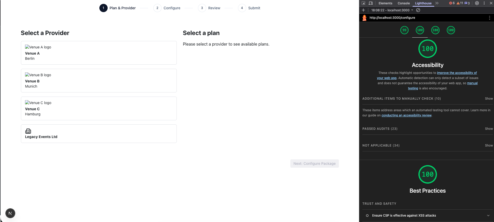
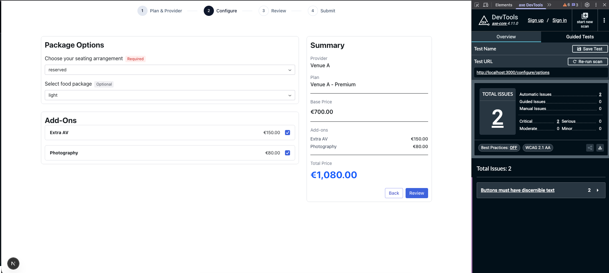
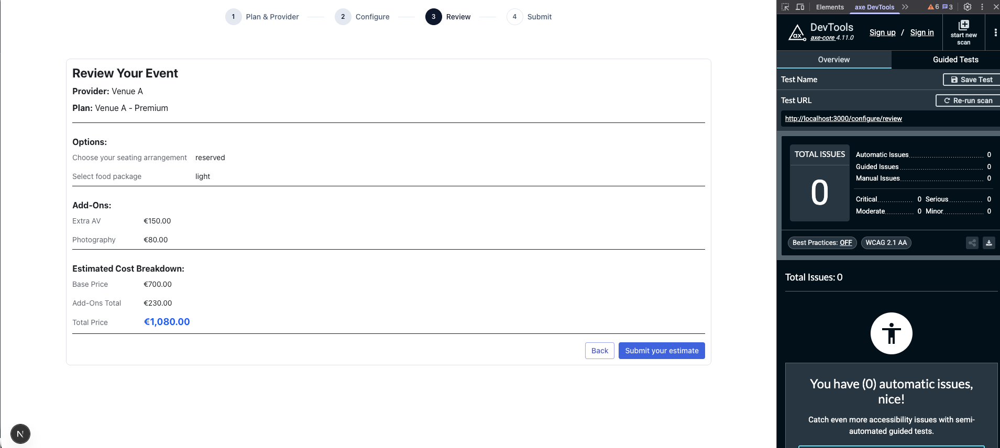
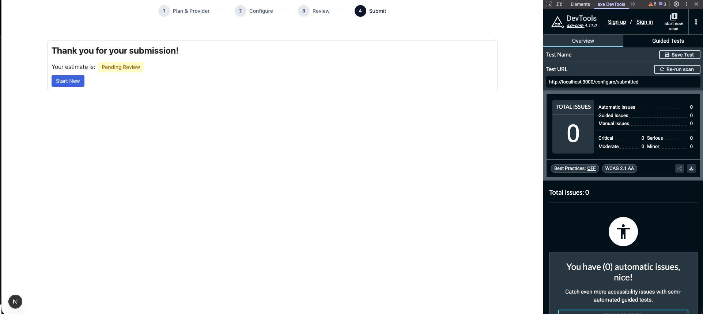

## **Information hierarchy**:

- Provider: Name & logo should be quite prominent and visible at a first glance. Perhaps users are aware of the providers and showing them these details quickly lets them identify the provider in a list. Location could also be important to a user too if they are planning an event and so it is highlighted with an icon and put right underneath the provider name (if present)

- Plan: Name & description here should be the first thing the user sees. After this the price should be easily identifiable on the card by being in bold or larger text. You would not want to make this too small and make it look like you're hiding it. The constraints are in their own row indicated by badges. This makes them standout as something to look at before making the decision.

- Options: Option name & a indicator that shows if the option is required or optional. Indicate required in a red or some noticable colour. Leave optional as a neutral colour (grey). For the options here there are some decisions that need to be made, some of which are business decisions. For options with only 1-4 options we can use a radio button group. This puts all the options on screen for the user to easily see. However we need to consider what default to use. If the field is required it may be ok to select the first option from the list. If the field is not required we could add a "None" option which is the default. This however automatically gives the options valid values & could lead to the user not looking at them. Using a select dropdown in these cases allows us to force the user to take the time & make a choice while also not making us need to add an extra option for non-required fields. In this case I chose to use selects for all the options as this allowed me to more clearly indicate that there is input needed by disabling the continue button until a decision has been made.

- Addons: This is relatively simple. I chose to use checkbox cards for each addon. The card has the addon name on left & the formatted price on the right.

- Summary: List the current details on right as configuring plan. Show plan name with provider name underneath it. Then indicate the Base price for the plan, then include a section for addons chosen & their price. Then a section underneath for total price. At the bottom include a button to continue to next step. An alert could be above this too which indicates any errors. The total price and addon sections will update as a user modifies their addons.

- For the review step I laid it out a little like an invoice. Plan & provider details at the top.
  Options chosen beneath and then addons chosen with their price.
  Last we have the Base price, addon price & total price.

- Summary screen due to time constraints is very simple with a message saying the state of the estimate (complete, pending etc) & a button to generate a new event which takes you back to step one. The status label has different colours to indicate the state. Pending approval in a warning yellow, completed in green for example.

## **Constraint communication**:

Each plan card has a set of badges on the card which communicate this particular plans constraints. Depending on their importance these could have a specific colour for example to ensure they stand out to the user, but I did not think for this project I had enough context to determine if one was more important than the others so they all share the same colour currently.

## **Error recovery**:

### Network Errors

- React Query handles automatic retries with exponential backoff for transient network failures
- User selections remain in component state, so no work is lost on a failed API call

### Validation Errors

- Blocking reasons from the API are displayed in a prominent Callout above the continue button
- Form state is preserved—user can correct the specific issue without re-entering other data

### Limitations (time constraints)

- No local storage persistence—if the user refreshes the page, progress is lost
- No offline support or request queuing
- If the estimate ID becomes invalid, user must start over

### With More Time

- Persist `estimateId` and current step to `sessionStorage` for refresh recovery
- Add optimistic updates with rollback on failure

## **One decision you'd revisit**:

- If given more time I would add some mechanism to store the users state locally so that they could recover their progress on a reload or revisit of the page. Something as simple as storing the estimateId in sessionStorage could be enough. Right now with the API routes available it would be a little roundabout to re-establish the users state in each step, particularly the first step as no information about the provider itself is stored in the estimate. If the estimate route was able to return the provider id alongside the plan id then this would be easier.

## **Accessibility Summary**

### Testing Tools Used

- axe DevTools (Chrome extension) - used for state-dependent pages to avoid reload issues
- Manual keyboard navigation testing

### axe DevTools Scan Results

#### Configure Page (`/configure`)

#### Options Page (`/configure/options`)

#### Review Page (`/configure/review`)

#### Submit Page (`/configure/submitted`)

### Accessibility Features Implemented

- **Keyboard navigation**: All interactive elements (buttons, form controls, cards) are reachable via Tab and operable via Enter/Space
- **Focus management**: Focus moves logically between steps; focus is returned to appropriate elements after state changes
- **Form semantics**: Proper `<label>` associations, `<fieldset>` groupings for related options, and `aria-required` attributes on required fields
- **Error announcements**: Blocking reasons displayed in a Callout component; price updates announced via `aria-live="polite"` regions
- **Color contrast**: Text and interactive elements meet WCAG AA contrast requirements
- **Screen reader support**: Dynamic price updates announced via `aria-live="polite"` regions (not verified with screen reader)

### Known Gaps

| Gap                                 | Reason                                                                                          |
| ----------------------------------- | ----------------------------------------------------------------------------------------------- |
| No skip-to-content link             | Time constraints; would add for multi-step navigation                                           |
| Limited focus styling customization | Relied on browser defaults; would add visible focus rings with brand styling                    |
| No screen reader testing            | Time constraints; would test with VoiceOver/NVDA to verify ARIA live regions announce correctly |
